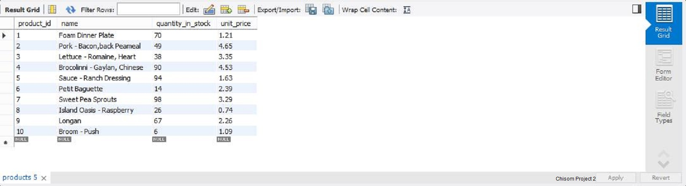
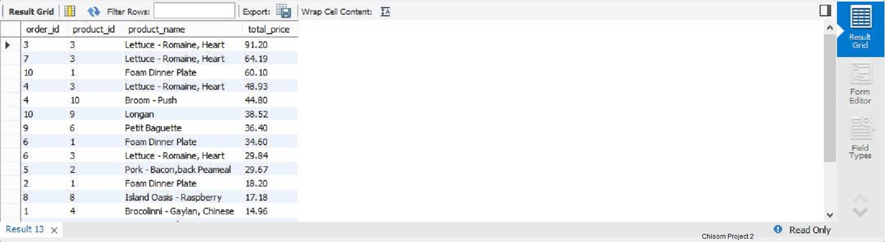

# Executing-Simple-Business-Analysis-using-MySQL

## Introduction:
  Below is some simple business analysis executed using MySQL queries and syntax across tables to obtain some business insight.
  
 **_Disclaimer_**: This is a self-developed data record across the tables provided.

## Step1:
   Creating database
		
      CREATE DATABASE abzdb;
		
      USE abzdb;
  
  Next, we import tables from the link [here](ChisomProject2Tables.zip)
  
  To view each table, we use the SELECT syntax against the name of each table
  
      SELECT * FROM customers;
      
          
      
      SELECT * FROM order_items;
      
        
        
      SELECT * FROM order_statuses;
      
        
      
      SELECT * FROM orders;
        
        
       SELECT * FROM products;
        
        
       SELECT * FROM shippers; 
       
       
       SELECT * FROM clients;
        
        
       SELECT * FROM payments;
        
        
        SELECT * FROM payment_methods;
          
          

## Case 1:

  Classifying customers loyalty according to their points with Bronze, Silver or Gold.
  
          SELECT 
            customer_id, first_name, points, ‘Bronze’ AS loyalty_type
          FROM customers
          WHERE points < 2000
          UNION
          SELECT 
            customer_id, first_name, points, ‘Silver’ AS loyalty_type
          FROM customers
          WHERE points BETWEEN 2000 AND 3000
          UNION
          SELECT 
            customer_id, first_name, points, ‘Gold’ AS loyalty_type
          FROM customers
          WHERE points > 3000
          ORDER BY points DESC;

        
        

## Case 2:

  Getting the top 5 loyal customers, for loyalty gifting 
  
            SELECT *
            FROM customers
            ORDER BY points DESC
            LIMIT 5;

        
        
## Case 3:

  Obtaining a record that defines each customer to their order
 
         SELECT
            o.order_id, o.order_date, c.customer_id, c.first_name, os.name AS status
          FROM orders o
          JOIN customers c
          USING (customer_id)
          JOIN order_statuses os
          ON o.status = os.order_status_id;

          
          
## Case 4:

  Obtaining the total price for ordered product
 
         SELECT 
            oi.order_id, oi.product_id, p.name AS product_name, 
            oi.quantity * oi.unit_price AS total_price
          FROM order_items oi
          JOIN products p 
          USING (product_id)
          ORDER BY total_price DESC;

    
    
## Case 5:

  Obtaining a record for products, and how many times such products have been ordered.

        SELECT 
          p.product_id, p.name AS product_name, oi.quantity AS product_quantity
        FROM products p
        LEFT JOIN order_items oi
        USING (product_id);

     
   
## Case 6:

  Next, obtaining a record of products delivered to customers
 
       SELECT
          c.customer_id, c.first_name AS customer_name, o.order_id, o.order_date, 
          sh.name AS shipper_name, os.name AS delivery_status
        FROM customers c
        LEFT JOIN orders o
        USING (customer_id)
        LEFT JOIN shippers sh
        USING (shipper_id)
        JOIN order_statuses os
        ON o.status = os.order_status_id
        ORDER BY c.customer_id;

         
         
    Hence, those entry with null, indicates such products have not been delivered yet.
    
  
## Case 7:

  Grouping order record into years for yearly analysis.
 
       SELECT 
          order_id, order_date, ‘2019’ AS order_year
        FROM orders
        WHERE order_date >= ‘2019-01-01’
        UNION
        SELECT 
          order_id, order_date, ‘2018’ AS order_year
        FROM orders
        WHERE order_date BETWEEN ‘2017-12-31’ AND ‘2019-01-01’
        UNION
        SELECT 
          order_id, order_date, ‘2017’ AS order_year
        FROM orders
        WHERE order_date BETWEEN ‘2016-12-31’ AND ‘2018-01-01’
        ORDER BY order_year;
  
       
       
## Case 8:

  Obtaining a record that defines the payment history for clients
      
       SELECT 
          p.date, p.invoice_id, p.amount, c.name AS client_name, pm.name AS payment_method
        FROM payments p
        JOIN clients c
        USING (client_id)
        JOIN payment_methods pm
        ON p.payment_method = pm.payment_method_id;

       
       
   This gives the payment date, payment amount and payment method for each customer.
   
  ** Appreciation:**
  Thank you for reading through, and feel free to drop a comment or suggestions.
  
      

 

